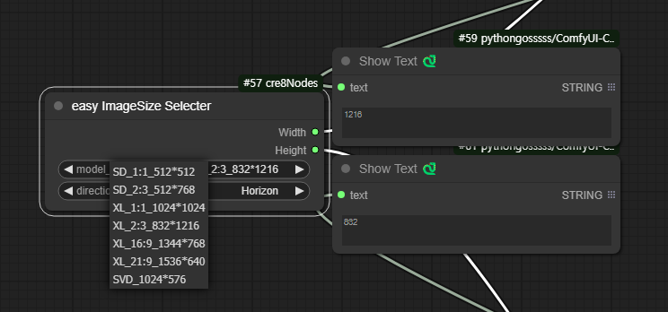
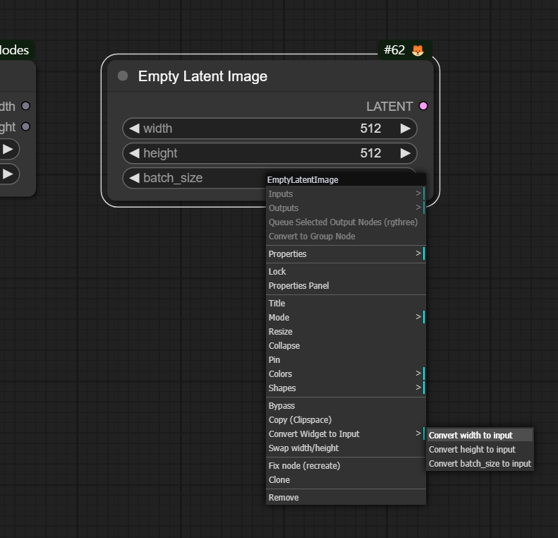
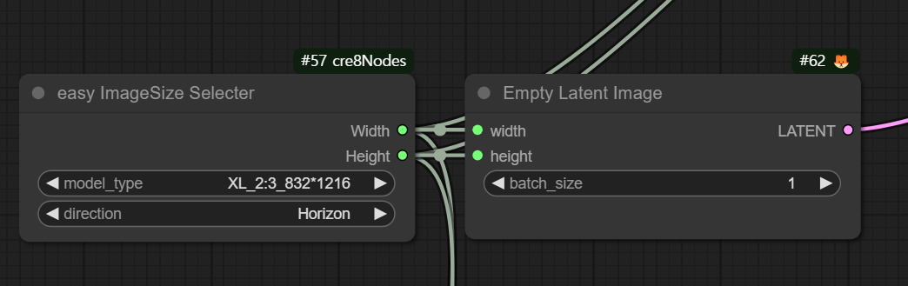

# ComfyUI-easy-ImageSize-Selecter

---

First of all, I tell you that I don't know how to programming. I just made it.
However, it works well.

---

**Custom node for ComfyUI**
Select the image size from the preset and select Vertical and Horizontal to output Width and Height.

In comfyUI, there is no use except for the 7 sizes shown here.This is because the models learned at a fixed size.
You just have to decide whether it's horizontal or vertical

### How to use it

just select presets (size & direction)
Then, it will export the width and height as INT.

In comfyUI, there are a lot of image size input fields. You can use it after pulling it.

Incase of nodes with built-in width and height inputs:
Right-click the mouse > Convert Widget to Input > Convert width(height) to input

